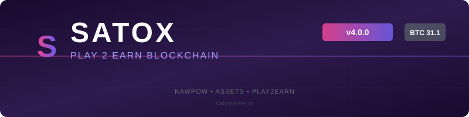

<div align="center">



**PS!** This repo ONLY contains the Satoxcoin Core Wallet, **NOT** the P2E System.

---


[](https://github.com/PFORMSatox/satoxcoin)
[](https://discord.com/invite/GFZYFuuHVq)
[](https://www.satoverse.io)
[](https://xplore.satoverse.io)
[](https://x.com/Satoverse_io)

</div>

---

## What is Satoxcoin?

**Satoxcoin ($SATOX)** is a PoW blockchain with native asset support, designed for Play2Earn gaming. Built on Bitcoin Core 31.1 with KAWPOW consensus, it provides full Ravencoin-compatible asset issuance, transfer, and management while maintaining the security guarantees of the modern Bitcoin codebase.

## What is Satoxcoin Core 4.0?

Satoxcoin Core 4.0 is a major rebase from Bitcoin Core 0.21 (Ravencoin 4.6.1 base) to **Bitcoin Core 31.1**, bringing all BTC security fixes while preserving the complete Satoxcoin asset system, KAWPOW consensus, and community fund.

### Key Improvements

| Feature | Details |
|---------|---------|
| BTC 31.1 security base | 16 CVEs fixed (CVE-2024-52911 through CVE-2025-54605) |
| C++17 / CMake | Modern build system, faster compilation |
| 55 mainnet checkpoints | Full chain hardening (height 0 → 1,865,353) |
| HIP2 8MB blocks | Satoxcoin-specific block size limit |
| KAWPOW security hardening | mix_hash forgery, nHeight forgery, epoch-DoS fixes |
| Asset system hardening | 6 critical/high security fixes in ConnectBlock/DisconnectBlock |
| Full asset index system | Address, spent, and timestamp indexes with 7 RPCs |
| Asset overflow BIP9 | Soft-fork prepared (activation deferred per policy) |

---

## Satoxcoin Specification

| Property | Value |
|----------|-------|
| **Total Supply** | 8 Billion (minted over ~100 years) |
| **Algorithm** | KawPoW |
| **Type** | PoW |
| **Block Time** | 60 seconds |
| **Block Reward** | 90% PoW / 10% P2E Fund |
| **Halving Interval** | 2,100,000 blocks (~4 years) |
| **Post-halving Subsidy** | 300 SATOX |
| **Dev / P2E Fund** | 10% of subsidy to `SQ5iQMsmqZiYY96rTx5Hisd7sx5GiGUbbN` |
| **P2P Port** | 60777 (mainnet) / 7060 (testnet) / 19444 (regtest) |
| **BIP44 Coin Type** | 1669 |
| **Base58 Address Prefix** | 63 (S) / 122 (script) / 112 (secret key) |

---

## What Makes Satoxcoin Unique?

- First P2E without the need for dedicated servers
- First P2E that works on 1160+ games on STEAM
- First P2E that works with gaming consoles (XBOX, STEAMDECK)

---

## Building from Source

### Prerequisites

- C++17 compatible compiler (GCC 10+ / Clang 12+)
- CMake 3.20+
- Ninja (recommended)
- Boost 1.74+
- libevent
- SQLite (wallet, bundled)

### Build Commands

```bash
# Configure and build
cmake -B build -G Ninja -DCMAKE_BUILD_TYPE=Release

cmake --build build -j$(nproc)

# Run tests
cd build
ctest -j$(nproc)

# Functional tests
python3 test/functional/test_runner.py
```

See [doc/build-*.md](doc/build-*.md) for platform-specific build instructions.

---

## Lineage

```
Bitcoin Core (0.15)
    └── Ravencoin (v4.6.1 / develop branch)
          └── Satoxcoin (3.0.0-rebase)
                └── Satoxcoin 4.0 (rebase to Bitcoin Core 31.1)
```

| Base | Version | What was taken |
|------|---------|----------------|
| **Bitcoin Core** | 31.1 | Consensus kernel, C++17, CMake build, security base, UTXO model, script engine, mempool |
| **Ravencoin** (develop) | 4.6.1 | Asset system, KAWPOW/X16RV2 PoW, restricted assets, qualifiers, messaging, HIP2 8MB blocks |
| **Satoxcoin 3.0.0** | 3.0.0-rebase | KAWPOW security fixes, asset-overflow BIP9, community autonomous fund (10% P2E), satoxcoin branding, 55 mainnet checkpoints |
| **Satoxcoin 4.0** | 4.0 | All above + BTC 31.1 security (16 CVEs), C++17, CMake, modernized asset DB, SQLite wallet, address/spent/timestamp indexes |

---

## License

Satoxcoin Core is released under the terms of the MIT license. See [COPYING](COPYING) for more information.

## Contributing

See [CONTRIBUTING.md](CONTRIBUTING.md) for the contribution workflow.

## Copyright

Copyright (c) 2013-2022 The Bitcoin Core developers.
Copyright (c) 2014-2018 The Raven Core developers.
Copyright (c) 2020-2021 The Satoxcoin Core developers.
Copyright (c) 2024-present The Satoxcoin Core developers (4.0 rebase).
